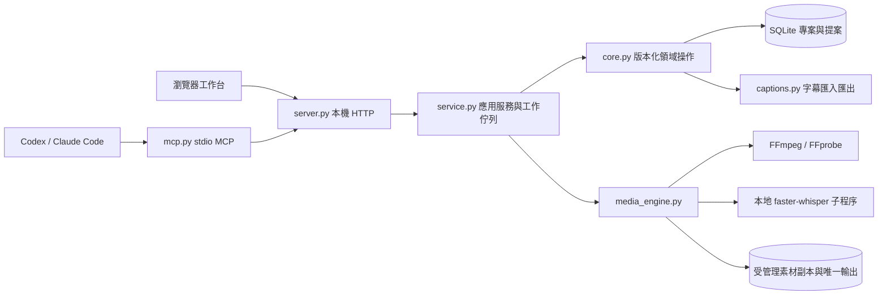

# 本地剪輯工作台：架構與 Agent Workflow

本階段交付以 Windows 本地工作台、智能剪口播、字幕與 MCP 為核心。瀏覽器負責操作與即時預覽，Python 保存專案及執行工作，FFmpeg 產生正式輸出。所有介面以繁體中文為主要語言。

這份文件描述目前實作與擴充邊界；完整剪映功能相容性、原生桌面安裝包與雲端素材服務尚未達成。

## 模組與資料邊界



| 模組 | 責任 | 不應放入的工作 |
| --- | --- | --- |
| `local_editor/core.py` | 驗證、時間軸變更、來源時間映射、SQLite 交易、復原、剪輯提案 | FFmpeg、網路、原始檔刪除、UI |
| `local_editor/captions.py` | SRT／VTT 解析、時間軸 SRT／VTT／TXT 匯出 | 語音模型載入、專案寫入 |
| `local_editor/media_engine.py` | 媒體探測、複製、縮圖、波形、靜音分析、ASR、正式渲染 | 自行修改專案版本 |
| `local_editor/service.py` | UI／Agent 共用工作入口、素材註冊、背景工作、輸出管理 | 繞過 `ProjectStore.mutate()` 改時間軸 |
| `local_editor/server.py` | Loopback HTTP、請求檢查、串流上傳與 Range 讀取 | 剪輯演算法 |
| `local_editor/mcp.py` | MCP handshake、tool schema、精簡結果、本機 HTTP bridge | 第二份專案儲存或獨立工作佇列 |
| `local_editor/web/` | 素材庫、屬性、字幕、時間軸、預覽與操作狀態 | 直接修改 SQLite、直接執行本機程式 |

`stdio MCP` 與內部 HTTP API 是兩個明確的介面。MCP 程序連到正在執行的工作台，UI 與 Agent 因此共用同一個專案狀態、工作佇列與操作紀錄。HTTP API 目前沒有實作 Streamable HTTP MCP transport。

## 啟動與本地資料

在專案目錄執行：

```powershell
python -m local_editor serve --port 8321 --data-dir .local-editor --open
```

若 FFmpeg 未在 `PATH`，可設定 `AGENT_VIDEO_FFMPEG` 與 `AGENT_VIDEO_FFPROBE` 指向已安裝的執行檔。先用工作台環境檢查或 MCP `editor_doctor` 確認實際可用性。

預設資料分布：

```text
.local-editor/
  projects/projects.sqlite3   專案 JSON、復原紀錄、剪輯提案
  assets/                    匯入素材的本機副本、縮圖
  uploads/                   串流上傳暫存
  work/                      分析與轉錄工作檔
  jobs/                      背景工作狀態 JSON
  exports/                   每個匯出工作專用的輸出目錄
```

素材匯入後複製到受管理目錄，剪輯以描述式資料保存。分割、剪除、復原與字幕調整均不改寫使用者的來源檔。MP4 匯出使用新的唯一檔名。

備份需涵蓋 SQLite 與 `assets/`；只有專案 JSON 無法恢復媒體。備份 SQLite 前應停止服務，或使用 SQLite backup API，以包含 WAL 中的已提交資料。

## 專案與時間座標

專案主要欄位為 `id/name/version/created_at/updated_at/width/height/fps/media/clips/captions/titles/caption_style`。`history` 回傳可復原與可重做的操作數量；service 另補上 `duration/can_undo/can_redo` 與受管理素材 URL。

| 物件 | 重要欄位 | 座標定義 |
| --- | --- | --- |
| 素材 `media` | `id,path,kind,duration,width,height,has_audio` | 媒體來源 |
| 片段 `clip` | `media_id,track,start,end,offset,speed` | `start/end` 為來源秒；`offset` 為時間軸秒 |
| 字幕 `caption` | `media_id,start,end,text,words?` | 保存在來源秒；`words` 為可選逐字對齊 |
| 文字 `title` | `text,start,end,x,y,font_size,color` | `start/end` 為時間軸秒 |
| 剪輯候選 `candidate` | `id,media_id,start,end,reason,kind?` | 要剪除的來源秒區間 |

```text
片段時間軸長度 = (end - start) / speed
來源點對應時間軸位置 = offset + (source_time - start) / speed
clip_split.at = 絕對時間軸秒數
```

支援 `video/audio/overlay` 三種軌道分類。影片／疊加畫面按片段順序合成，overlay 位於主影片上方；重疊音訊會混音。這個資料模型尚未包含任意多條具名軌道、軌道鎖定與群組。

淡入淡出以各片段自己的長度計算。分割點位於淡變區間時，新的片段會重新限制淡變時間；跨分割保留完全相同的曲線仍需 envelope／關鍵影格資料模型。

來源字幕透過 `mapped_captions(project)` 依主 `video` 片段映射。相同素材使用多次時會產生多份時間軸字幕。具逐字對齊的字幕會依保留區間篩選文字並映射每個 word 的時間，剪除的詞不會留在匯出字幕中。手動更改字幕文字或時間會清除過期逐字對齊。

SRT／VTT 通常只有整句時間；裁掉一句的局部時，系統能同步字幕顯示時間，精確的文字刪改仍需校正。後續可接入 forced alignment，重新建立修改後的逐字對齊。

## 交易、復原與提案契約

```python
store = ProjectStore(data_dir)
project = store.create_project("口播剪輯", width=1920, height=1080, fps=30)
project = store.mutate(project["id"], project["version"], "clip_add", {
    "media_id": media_id, "track": "video", "start": 0, "end": 10, "offset": 0
})
```

每次寫入以 SQLite `BEGIN IMMEDIATE` 交易重新讀取目前狀態並檢查 `expected_version`。同一版本的多個並行 writer 最多一個成功。錯誤以繁體中文 `EditorError` 提供 `code/status`；過期版本回傳 `version_conflict`／HTTP 409。

復原與重做也建立更高的版本，版本永不倒退。最近 100 步 snapshot 保存於 SQLite，重啟後仍可復原。新的編輯會清除 redo 分支。NaN、Infinity、非法引用、重複 ID、無效時間與超出可渲染範圍的數值會在交易中拒絕，失敗時整筆回滾。

支援的 mutation actions：

- 專案：`rename/settings/undo/redo`。
- 片段：`clip_add/clip_update/clip_move/clip_split/clip_delete`。
- 字幕：`captions_set/caption_update/caption_delete/caption_style`。
- 文字：`titles_set/title_add/title_update/title_delete`。
- 內部媒體註冊：`media_add`，外部呼叫需經素材匯入入口。
- 提案套用：`smart_cut_apply`，需已保存的提案 ID 與明確候選 ID。

智能剪口播流程：

1. `prepare_plan(project_id, expected_version, candidates, metadata)` 驗證來源區間並保存提案，不更動專案版本。
2. 提案記錄 `base_version`。呼叫者閱讀候選理由、範圍並試聽，再明確指定 `candidate_ids`。
3. `apply_plan()` 在交易中同時檢查目前版本與提案版本；重複或未知候選 ID 會拒絕。
4. 候選來源區間對應到所有受影響的主影片片段；重疊剪除區間合併。
5. 同步切開所有軌道與文字，剪除對應時間窗並 ripple；來源字幕保持不動，顯示與匯出時重新映射。
6. 至少保留一個主影片片段；可用一般 undo 還原整筆操作。

內建分析使用 FFmpeg 音量／靜音偵測，加上「整句為獨立語助詞」與「相鄰字幕文字完全相同」的保守規則。需要語意判斷的刪文剪片，可由外部 Agent 讀取逐字稿後呼叫 `editor_prepare_plan`。

## API 與背景工作

所有變更 JSON 需傳入 `expected_version`。UI 使用工作階段 token；伺服器只綁定 `127.0.0.1`，檢查 Host／Origin，素材讀取限於已註冊的受管理檔案。

| HTTP 入口 | 用途 |
| --- | --- |
| `GET /api/session`、`GET /api/doctor` | 本機工作階段與環境能力 |
| `GET/POST /api/projects` | 列表與建立專案 |
| `GET /api/projects/{id}` | 專案快照 |
| `POST /api/projects/{id}/edit` | 版本化編輯 |
| `POST /api/projects/{id}/media/import`、`media/upload` | 本機路徑匯入、瀏覽器串流上傳 |
| `POST /api/projects/{id}/captions/import` | SRT／VTT 匯入 |
| `GET /api/projects/{id}/captions/export?format=srt` | 剪輯後字幕匯出 |
| `POST /api/projects/{id}/smart-cut` | 建立背景分析工作 |
| `POST /api/projects/{id}/plans`、`GET .../plans/{plan_id}` | 明確區間提案與提案讀取 |
| `POST /api/projects/{id}/smart-cut/apply` | 套用提案 |
| `POST /api/projects/{id}/transcribe`、`export` | 本機 ASR、MP4 匯出工作 |
| `GET /api/jobs/{job_id}` | 工作狀態與結果 |
| `GET /api/exports/{job_id}/{filename}` | 已成功註冊的輸出檔 |

工作狀態依序為 `queued → running → succeeded/failed`。預設兩個 worker、最多八筆排隊或執行中工作。ASR 與分析完成後再次檢查版本；分析期間的手動編輯不會被舊結果覆寫。匯出使用提交當下的 snapshot，結果包含輸出版本與完成時的目前版本。

重啟後，先前尚在排隊或執行中的工作會標示中斷失敗。自動續跑、取消工作與跨程序工作租約仍屬後續功能。

## Agent 分工與 token 控制

v0.2 已擴充情境、聲畫證據、批次提案與驗證模組。新增 `understanding.py`、`evidence.py`、`observation_service.py`、`contracts.py`，以及 UI `agent-workspace.js`。當前細節見 [Agent 理解升級](agent-understanding-v02.md)；以下 2026-09-07 驗證段落保留為 v0.1 歷史證據。

MCP 啟動入口：

```powershell
python -m local_editor mcp --url http://127.0.0.1:8321
```

| Agent 角色 | 讀取與輸出 | 寫入方式 |
| --- | --- | --- |
| 協調 Agent | 專案版本、任務需求、完成條件 | 統一安排變更順序 |
| 分析 Agent | 素材資訊、來源逐字稿、候選理由 | 建立提案，不直接刪片 |
| 字幕 Agent | 來源字幕、用字與對齊問題 | 使用最新版本提交字幕修改 |
| 剪輯 Agent | 已選定提案、片段與樣式需求 | 套用提案或 `editor_edit` |
| 驗收 Agent | 提案差異、映射字幕、輸出工作與媒體資訊 | 原則上唯讀，回報需修正項目 |

同專案可以並行分析，變更由單一寫入者依序提交。每次操作成功後沿用回傳的新版本；409 時重新讀取、重算差異，避免只換上新版本重送舊意圖。

建議工具順序：`editor_doctor → editor_list_projects → editor_get_project → editor_prepare_smart_cut/editor_prepare_plan → editor_job_status/editor_get_smart_cut_plan → 審閱 → editor_apply_smart_cut → editor_export_captions → editor_export → editor_job_status`。

token 控制採三個現有策略：專案列表只回摘要；一般 mutation 回傳版本、時長及數量；MCP 剔除波形與縮圖資料。影片 bytes 走本機媒體管線，不傳進模型上下文。長工作只輪詢工作狀態；較長逐字稿的分頁／區間讀取與 batch edits 可列為下一階段 API。

## 驗證證據與後續工作

2026-09-07 最終自動化檢查執行：

```powershell
python -m unittest discover -s tests -v
node --test tests/editor_frontend.test.mjs
```

早期隔離環境的 39 項檢查曾跳過 4 項 FFmpeg 測試；後續已在本機使用實際 FFmpeg 完成媒體測試。最終完整 Python 執行收集 51 項，50 項通過、1 項既有 FFmpeg 環境變數優先順序測試失敗；修正後對應模組 9 項定向複測全部通過，沒有尚未解決的失敗。JavaScript 6 項測試全部通過。此紀錄保留完整執行與修正後複測的區別。

瀏覽器已實際走通素材匯入、智能剪口播、字幕編輯、逐字稿刪片與復原、標題、MP4 匯出，以及離線中文 ASR。驗收影片從 6 秒剪為 4.4 秒，輸出經 FFprobe 與 FFmpeg 完整解碼；另一段約 17 秒的本機合成中文語音成功產生 4 句字幕。真實 stdio MCP 亦已對執行中的服務完成握手與 15 項工具探索。完整證據與視覺驗收限制見 [本機驗收紀錄](local-editor-acceptance.md)。

```text
已實作並有本輪測試證據
├─ SQLite 持久化、並行版本衝突、復原／重做
├─ 裁切、分割、變速、來源字幕與逐字時間映射
├─ 智能剪提案、重疊區間合併、多軌 ripple、整筆復原
├─ SRT／VTT 解析與字幕文字匯出
├─ HTTP session/Host/Origin、受管理媒體、Range
└─ 真實 stdio MCP subprocess 與 HTTP 共用專案

已於本機驗收的媒體與介面流程；跨機器仍需重驗
├─ FFmpeg 素材探測、波形、靜音分析、MP4 合成與完整解碼
├─ 本地 ASR 套件與模型載入、合成中文語音辨識與繁中轉換
└─ 瀏覽器匯入、剪口播、字幕編輯、復原、標題與 MP4 匯出

後續 TODO
├─ 時間軸：任意具名多軌、群組／鎖定、關鍵影格、跨分割淡變曲線、轉場、複合片段
├─ 影像：遮罩、追蹤、去背／摳像、防手震、光流補幀、代理檔與色彩管理
├─ 字幕：forced alignment、逐字卡拉 OK、雙語字幕、說話者辨識、斷句策略
├─ 智能剪輯：句內語助詞、語意冗長／重錄判斷、保留規則、品質評分
├─ 媒體：更完整音效鏈、GPU 編碼、格式配置、超長片效能與預覽代理
├─ Workflow：取消／續跑、batch edits、局部讀取、持久化稽核與資料回收
└─ 產品：原生安裝包、素材管理、鍵盤映射、專案搬移／備份／遷移
```

擴充時優先建立一個可測試的 core operation、對應 service 入口與版本檢查，再接 UI／MCP。新媒體能力應保存明確參數與輸出證據；保持 Agent 與使用者使用相同領域契約。
